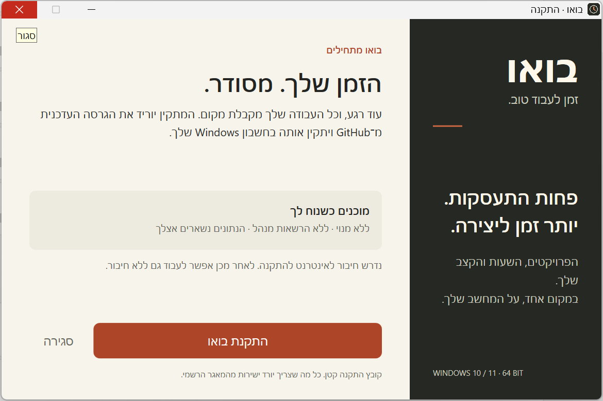

<div dir="rtl">

# בואו · זמן לעבוד טוב

אפליקציה אישית בעברית למעקב זמן עבודה, לקוחות ופרויקטים. עם חלון צף זעיר שנשאר מעל החלונות, דוחות ושמירה מקומית במחשב שלך.

## התקנה ב־Windows

### [⬇ הורדת המתקין הקטן של בואו](https://github.com/huxhkuh/bou-time/releases/latest/download/Bou-Install.exe)

1. מורידים ופותחים את **Bou-Install.exe** — קובץ קטן של כ־38 KB.
2. לוחצים **התקנת בואו**. המתקין מוריד את הגרסה העדכנית מ־GitHub, בודק את הקובץ ומתקין בחשבון Windows הנוכחי, ללא בקשת הרשאות מנהל.
3. לוחצים **פתיחת בואו**. קיצור דרך נוסף לשולחן העבודה ולתפריט ההתחלה.

נדרש Windows 10/11 עם מעבד x64 וחיבור לאינטרנט להתקנה. לאחר ההתקנה אפשר לעבוד ללא חיבור. אין צורך ב־Node.js, בחשבון משתמש באפליקציה או בשירות בתשלום.

**[כל הגרסאות וההורדות](https://github.com/huxhkuh/bou-time/releases/latest)** — שם זמינים גם המתקין המלא להתקנה ללא חיבור (`Setup.exe`), גרסה ללא התקנה (`Portable.exe`) וקובץ בדיקות תקינות (`SHA256SUMS.txt`).

הקבצים עדיין אינם חתומים בתעודת מפרסם, ולכן Windows עשוי להציג אזהרת מפרסם לא מזוהה. אין צורך לשנות את הגדרות האבטחה. עדכון מתבצע בהפעלה חוזרת של המתקין הקטן אחרי סגירת בואו; אין עדכון אוטומטי ברקע.



## מה יש בפנים

- לקוחות ופרויקטים עם צבע, תיאור, ארכיון, תעריף שעתי או מחיר כולל ויעד שעות.
- טיימר עם השהיה והמשך, שמירה לפי חותמות זמן והתאוששות אחרי סגירה או שינה.
- **צג צף זעיר** עם פרויקטים זה מתחת לזה. לחיצה על פרויקט שומרת את הזמן הקודם ומתחילה את הבא.
- רישום ידני, עריכה, התראה על חפיפות ותמיכה בעבודה שחוצה חצות.
- סיכומי יום ושבוע, דוחות לפי לקוח ופרויקט וייצוא CSV בעברית לאקסל.
- גיבוי מלא וייבוא עם מניעת כפילויות. נתוני הדגמה מופרדים מהנתונים האישיים.
- עברית, RTL, אזור הזמן של ישראל ומצב מיקוד. **Alt+P** פותח צג צף; **Alt+F** פותח מצב מיקוד.

## איפה נשמר המידע ואיך מגבים

ב־Windows הנתונים נשמרים מקומית ב־IndexedDB תחת `%APPDATA%\BouTime`, בנפרד לכל משתמש Windows. המתקין מתקין את התוכנה בלבד; הוא אינו מעלה את הלקוחות, הפרויקטים או השעות ל־GitHub. אין סנכרון ענן.

בתוך האפליקציה: **גיבוי והגדרות → ייצוא גיבוי מלא**. שמרו את קובץ ה־JSON גם במקום נוסף. לשחזור: **בחירת קובץ גיבוי לשחזור → ייבוא ומיזוג**. התקנה חוזרת והסרת התוכנה משאירות את הנתונים האישיים במקומם.

גרסת הדפדפן שומרת נתונים באותו דפדפן ומכשיר בלבד. מעבר מהדפדפן לאפליקציית Windows דורש ייצוא גיבוי וייבוא שלו. מומלץ לעצור ולשמור מדידה לפני המעבר.

## פיתוח ובדיקות

</div>

```powershell
git clone https://github.com/huxhkuh/bou-time.git
cd bou-time
npm ci
npm run dev
# http://127.0.0.1:5173

npm test
npm run test:e2e
npm run build
npm run test:desktop:compact
powershell -ExecutionPolicy Bypass -File scripts/test-installer.ps1
```

<div dir="rtl">

נדרש Node.js בגרסה 22.12 ומעלה או גרסה חדשה נתמכת. בדיקות הדפדפן משתמשות ב־Chrome מותקן. `npm run desktop` פותח את גרסת Windows אחרי `npm run build`. הוראות בנייה והפצה נמצאות ב־[RELEASING.md](docs/RELEASING.md).

טכנולוגיות: React, Vite, Electron, IndexedDB; מתקין קטן ב־WPF ו־.NET Framework, ומתקין התוכנה ב־NSIS. Windows ARM ומערכות Windows ישנות לא נבדקו.

</div>
